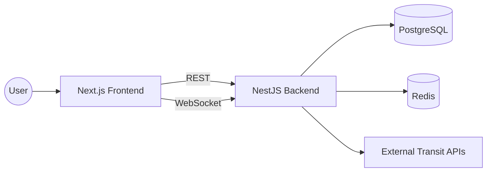
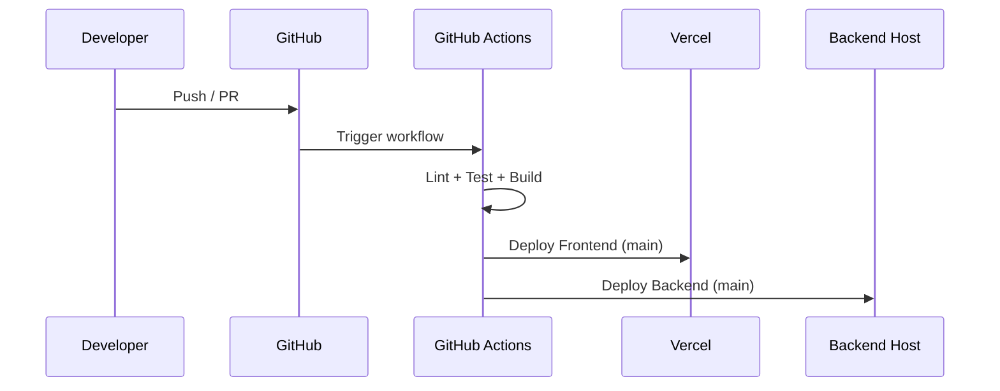

# MetroFlow - Real-time Transport Intelligence Platform

## Overview

MetroFlow is a modern, full-stack real-time transport intelligence platform built with Next.js 15 and NestJS.

## Tech Stack

### Frontend

- **Next.js 15** (App Router)
- **React 19** with React Compiler
- **TypeScript** for type safety
- **Tailwind CSS v4** for styling
- **ShadCN UI** for component library
- **React Query** for state management
- **WebSocket/SSE** for real-time updates
- **Recharts** for data visualization
- **Leaflet** for mapping
- **Zod** for validation
- **Sentry** for error tracking
- **Vercel Analytics** for monitoring

### Backend

- **NestJS** (modular architecture)
- **TypeScript**
- **REST API + WebSocket Gateway**
- **PostgreSQL/MongoDB** for persistence
- **Redis** for caching
- **Pino** for logging
- **Swagger** for API documentation
- **Class-validator** for validation
- **Sentry** for error tracking

### DevOps & Security

- **GitHub Actions** for CI/CD
- **Docker** & **Docker Compose**
- **Helmet** for security headers
- **Rate limiting**
- **Strict CSP** (Content Security Policy)
- **Environment variable management**
- **Vercel** for frontend deployment
- **Railway/Render** for backend deployment

## Project Structure

```
project/
├── frontend/              # Next.js 15 frontend
│   ├── app/              # App Router
│   ├── components/       # React components
│   ├── core/            # Types, utils, constants
│   ├── modules/         # Feature modules
│   └── providers/       # Context providers
├── backend/             # NestJS backend
│   ├── src/
│   │   ├── modules/     # Feature modules
│   │   ├── common/      # Shared utilities
│   │   └── main.ts      # Entry point
│   └── Dockerfile
├── docker-compose.yml
├── .github/
│   └── workflows/
│       └── ci-cd.yml
└── README.md
```

## Architecture

### System Overview



### CI/CD Flow



## Getting Started

### Prerequisites

- Node.js 18+
- npm or yarn
- Docker (optional)
- PostgreSQL (or use Docker)

### Frontend Setup

```bash
cd frontend
npm install
cp .env.local.example .env.local
npm run dev
```

Open http://localhost:3000

### Backend Setup

```bash
cd backend
npm install
cp .env.example .env
npm run dev
```

API runs on http://localhost:3001
Swagger docs: http://localhost:3001/api/docs

### Docker Setup

```bash
docker-compose up
```

## Development

### Frontend Commands

```bash
npm run dev       # Start development server
npm run build     # Build for production
npm run lint      # Run ESLint
npm run format    # Format code with Prettier
npm run type-check # TypeScript check
```

### Backend Commands

```bash
npm run dev       # Start with watch mode
npm run build     # Build for production
npm run start     # Run production build
npm run lint      # Run ESLint
npm run test      # Run tests
```

## Environment Variables

### Frontend (.env.local)

See `.env.local.example`

### Backend (.env)

See `.env.example`

## Database Migrations

```bash
cd backend
npm run typeorm migration:generate -- -n MigrationName
npm run typeorm migration:run
```

## Deployment

### Frontend (Vercel)

```bash
vercel deploy
```

### Backend (Railway/Render)

- Connect GitHub repository
- Set environment variables
- Deploy

## Versioning Strategy

We use **Semantic Versioning (SemVer)**: $MAJOR.MINOR.PATCH$.

- **MAJOR**: breaking changes
- **MINOR**: new features (backwards compatible)
- **PATCH**: bug fixes and small improvements

Recommended release flow:

1. Merge to `main` via PR
2. Create a git tag like `v1.2.3`
3. Publish release notes

## Contributing

1. Create feature branch: `git checkout -b feature/name`
2. Commit changes: `git commit -am 'Add feature'`
3. Push to branch: `git push origin feature/name`
4. Create Pull Request

## License

MIT
