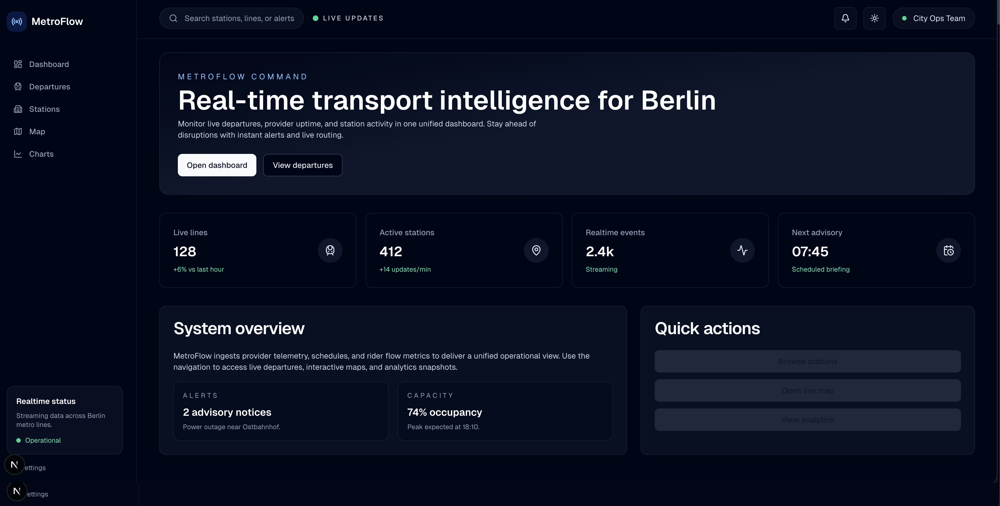
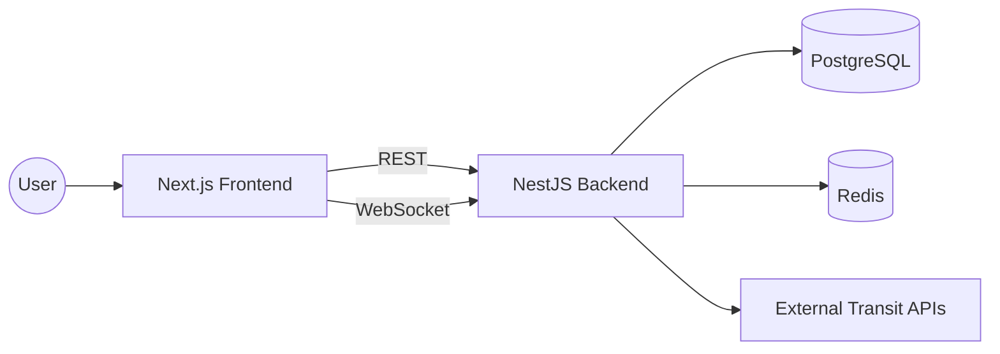
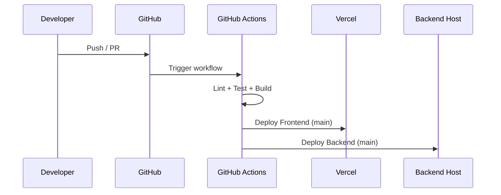

# MetroFlow - Real-time Transport Intelligence Platform


MetroFlow is a modern, full-stack real-time transport intelligence platform built with Next.js 15 and NestJS.





### Frontend

- **Next.js 15,  19, TypeScript** for type safety, Tailwind CSS, ShadCN UI, React Query, WebSocket/SSE, Recharts, Leaflet, Zod, Sentry, Vercel Analytics** for monitoring

### Backend

- **NestJS, TypeScript, REST API + WebSocket Gateway, PostgreSQL/MongoDB, Redis, Pino, Swagger, Class-validator, Sentry

### DevOps & Security

- **GitHub Actions** for CI/CD, Docker, Helmet, Rate limiting, Strict CSP, Environment variable management, Vercel** for frontend dev, Railway/Render for backend dev


## Architecture

### System Overview


```mermaid
flowchart LR
	User((User)) --> Web[Next.js Frontend]
	Web -->|REST| API[NestJS Backend]
	Web -->|WebSocket| API
	API --> DB[(PostgreSQL)]
	API --> Cache[(Redis)]
	API --> Ext[External Transit APIs]
```

### CI/CD Flow


```mermaid
sequenceDiagram
	participant Dev as Developer
	participant GH as GitHub
	participant CI as GitHub Actions
	participant Vercel as Vercel
	participant Server as Backend Host

	Dev->>GH: Push / PR
	GH->>CI: Trigger workflow
	CI->>CI: Lint + Test + Build
	CI->>Vercel: Deploy Frontend (main)
	CI->>Server: Deploy Backend (main)
```

## Getting Started

### Prerequisites

- Node.js 18+
- npm or yarn
- Docker (optional)
- PostgreSQL (or use Docker)

### Frontend Setup

```bash
cd frontend
npm install
cp .env.local.example .env.local
npm run dev
```

Open http://localhost:3000

### Backend Setup

```bash
cd backend
npm install
cp .env.example .env
npm run dev
```

API runs on http://localhost:3001
Swagger docs: http://localhost:3001/api/docs

### Docker Setup

```bash
docker-compose up
```

## Development

### Frontend Commands

```bash
npm run dev       # Start development server
npm run build     # Build for production
npm run lint      # Run ESLint
npm run format    # Format code with Prettier
npm run type-check # TypeScript check
```

### Backend Commands

```bash
npm run dev       # Start with watch mode
npm run build     # Build for production
npm run start     # Run production build
npm run lint      # Run ESLint
npm run test      # Run tests
```

## Step-by-Step Testing

Use this checklist to verify MetroFlow end-to-end from a clean terminal session.

### 1) Pre-checks

- Use Node.js 20.9+ (recommended: Node 22)
- Install dependencies once:

```bash
cd backend && npm install
cd ../frontend && npm install
```

### 2) Build verification

```bash
cd backend
npm run build

cd ../frontend
npm run build
```

Expected result: both builds finish without TypeScript errors.

### 3) Start backend API

```bash
cd backend
npm run dev
```

Backend default URL: `http://localhost:3001`

Quick smoke check:

```bash
curl -s http://localhost:3001/api/ingest/routes | jq .
```

Expected result: JSON response with `dataDir`, `rawDir`, `canonicalDir`, and `routes`.

### 4) Run ingest probe test (GTFS)

In a new terminal:

```bash
curl -s -X POST http://localhost:3001/api/ingest/probe \
	-H "Content-Type: application/json" \
	-d '{"gtfsZipPath":"./data/gtfs/sample-gtfs.zip"}' | jq .
```

Expected result: `{ "jobId": "...", "status": "queued" }`

Poll job status:

```bash
curl -s http://localhost:3001/api/ingest/jobs/<jobId> | jq .
```

Expected result: `status: "completed"` and a `result` object containing:

- `stats` (`shapeCount`, `pointCount`, `canonicalPointCount`)
- `routeArtifacts` with `rawPath` and `canonicalPath`
- optional `validationWarnings`

### 5) Verify generated artifacts

```bash
curl -s http://localhost:3001/api/ingest/routes | jq .
```

Expected result: each route includes raw and canonical file paths and point counts.

Inspect one canonical file:

```bash
cat backend/data/canonical/route-shape_A.geojson | jq .
```

Expected result: valid GeoJSON `FeatureCollection` with a `LineString` geometry.

### 6) Start frontend and verify tracking page

In a separate terminal:

```bash
cd frontend
npm run dev
```

Open: `http://localhost:3000/tracking`

Manual checks on `/tracking`:

- Click **Probe GTFS/GPX** and wait for completion
- Confirm **Logs** shows queued/completed status
- Confirm **Route List** shows route entries
- Toggle **Raw / Canonical** and verify point counts/path values update

Optional terminal check:

```bash
curl -s http://localhost:3000/tracking >/dev/null && echo "Tracking page reachable"
```

### 7) Automated test commands

Frontend:

```bash
cd frontend
npm run test
npm run test:e2e
```

Backend:

```bash
cd backend
npm run test
npm run test:e2e
```

### 8) Common troubleshooting

- Port already in use (3001):

```bash
lsof -i :3001 | grep -v COMMAND | awk '{print $2}' | xargs -r kill -9
```

- Next.js Node version error: switch Node version before running frontend:

```bash
nvm use 22
```

## Environment Variables

### Frontend (.env.local)

See `.env.local.example`

### Backend (.env)

See `.env.example`

## Database Migrations

```bash
cd backend
npm run typeorm migration:generate -- -n MigrationName
npm run typeorm migration:run
```

## Deployment

### Frontend (Vercel)

```bash
vercel deploy
```

### Backend (Railway/Render)

- Connect GitHub repository
- Set environment variables
- Deploy

## Versioning Strategy

We use **Semantic Versioning (SemVer)**: $MAJOR.MINOR.PATCH$.

- **MAJOR**: breaking changes
- **MINOR**: new features (backwards compatible)
- **PATCH**: bug fixes and small improvements

Recommended release flow:

1. Merge to `main` via PR
2. Create a git tag like `v1.2.3`
3. Publish release notes

## Contributing

1. Create feature branch: `git checkout -b feature/name`
2. Commit changes: `git commit -am 'Add feature'`
3. Push to branch: `git push origin feature/name`
4. Create Pull Request

## License

MIT
